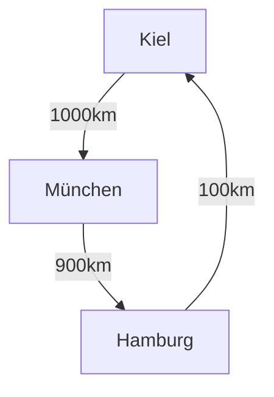

# AlgoDat - 16.01.2025
Die letzte Veranstaltung wird verwendet für Klausurvorbereitung. Letztes Jahr gab es 9 Aufgaben à je 10 Punkte.

8 von 9 Aufgaben waren so im Skript zu finden in der letzten Klausur.

Durchfallquote letztes Semester: *ca 10-15%*. Diese Durchfallquote variiert allerdings sehr stark und lässt sich nicht deutlich festlegen, sodass sie jedes Mal dasselbe ist.

>[!WARNING] Falls bei einer Aufgabe alle Studierenden schlecht abschneiden, dann wertet Hufenbach diese Aufgabe deutlich besser. Dabei wird nur auf Zenturienebene besser gewertet.

Arraylists werden in Java sehr häufig verwendet, allerdings wird dort häufig Speicher verschwendet.

Es gibt allerdings auch eine andere Art der Implementation; die LinkedList.
Eine LinkedList hat zwei Zeiger. In den einen Zeiger kommt der Inhalt rein und der zweite Zeiger zeigt auf das nächste Element.

>[!STRENGTHS] LinkedLists erlauben unendlich große Listen, die nur durch die Größe des Computerspeichers begrenzt ist. LinkedLists erlauben außerdem das Löschen von einem bestimmten Element, ohne dass dabei eine der Daten gelöscht würde.

>[!WEAKNESSES] LinkedLists erlauben kein Springen zu einem bestimmten Pointer.

In einer Klausur könnten Graphen drankommen.

>[!QUOTE] "Zeichnen Sie durch einen selbstgewählten Graphen einen gewichteten, ungewichteten und zyklenfreien Graphen."
## Graphen
### Gewichtete Graphen
Bei einem gewichteten Graphen kann man dem Graphen einen Wert geben.

## Interpolationssuche
## Insertion Sort
Ein Sortierverfahren, das Decrease & Conquer zuzuordnen ist.