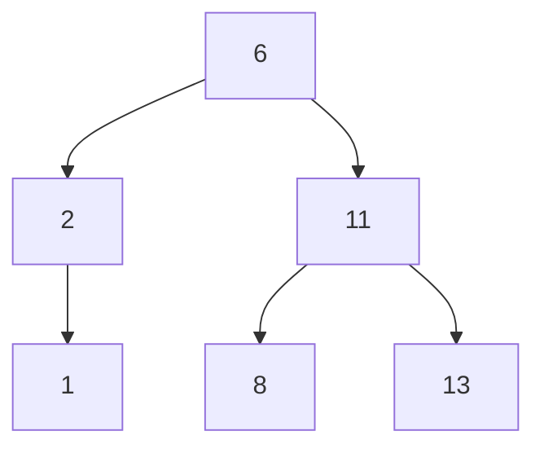

# <font color = "orange">AuD - 24.01.2025</font>
Bearbeitung der geringsten Distanz zwischen zwei Elementen:
```
Function minDistance(A[0 ... n-1])
	min = int.maxValue
	for (int i;i < n-1;i++) {
		for (int j = i+1;j < n;j++){
		if (distance(A[i],A[j])<min) {
			min = distance(A[i],A[j])
			}
		}
	}
```

Die Gleichheit zwischen zwei Elementen ist eine gewisse Art Relation.

## Median Bestimmung
### Bruteforce
```
Function median(A[0 ... n-1]) {
	K = |n/2|
	for (int i=0;i < n; i++) {
		numssmaller=0;
		numsequal=0;
		for (int j=0;j < n; j++) {
			if (A[j] < A[i]){
				numssmaller++;
			} else if (A[j] == A[i]) {
				numsequal++
			}
		}
	}
	if(numssmaller = K) {
		return A[i];
	}
}
```
### Vorsortiert
Einfach den mittleren Wert herausholen: A[n/2]

## Min / Max
### Bruteforce
Alle anschauen und min und Max bis zum Ende merken.
$\Theta(n)$
### Divide & Conquer
```
Min(A[0...n-1]) = minimum(Min(A[0 ... [(n-1)/2]]),Min(A[[(n-1)/2]+1...n-2]))
```
Ausführungshäufigkeit der Basisoperation:
```
T(n) = 1 + 2 * T(n/2)
T(1) = 0
T(2^K) = 1 + 2 * T(2^{K-1})
= 1 + 2 (1 + 2T (2^{K-2}))
= 1 + 2 + 4T (2^{K-2})
= 1 + 2 + 4 + 8T (2^{K-3})
= 2^3 - 1 + 8T (2^{K-3})
= 2^{K-1} = n - 1
```

## Binäre Suchbäume

Binäre Suchbäume sollten möglichst breit und flach sein.
Datenbanken ordnen sich nachts neu und machen damit neue binäre Suchbäume.

Es gibt für jedes Element ein eindeutiges System.
Wird beispielsweise die 11 gelöscht, wird die 13 oder die 8 hochgezogen.
Die Effizienz von Binären Suchbäumen liegt bei $3log_2n$
Inorder-Traversierung liefert sofort sortierte Liste der Schlüssel. In diesem Fall würde die Liste bei 1 beginnen und sich bis 13 ziehen.

Bäume können rebalanciert werden.

### AVL-Baum
Der AVL-Baum ist ein binärer Suchbaum. Für *alle* seine Knoten gilt, dass der Unterschied der Höhe des linken und rechten Unterbaums höchstens 1 beträgt.
Siehe [[AuD06_WINF.pdf#page=15|Folien]].
Die AVL-Eigenschaft soll erhalten werden.
