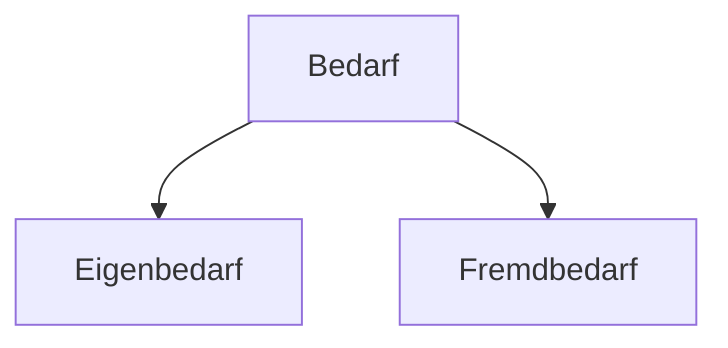

# Bedarf

>[!INFO] **Definition**
>Bedarf entsteht, indem **[[Bedürfnis]] und Kaufkraft kombiniert** werden.

Bedarfe werden in der Betriebswirtschaft aufgeteilt in zwei Unterkategorien:

#### Eigenbedarf
Eigenbedarf ist der Bedarf, den ein [[Betrieb]] selbst hat. Das Ziel eines Betriebes ist, diesen zu decken.

#### Fremdbedarf
Fremdbedarf ist der Bedarf von anderen, die ja selbst einen Eigenbedarf haben. Diese versuchen, ihn zu decken und benötigen dafür jemanden, der Fremdbedarfsdeckung betreibt, um zur Verfügung zu stellen, was auch immer nötig ist, um diesen Bedarf zu decken. [[Unternehmen]] betreiben vor allem Fremdbedarfsdeckung.