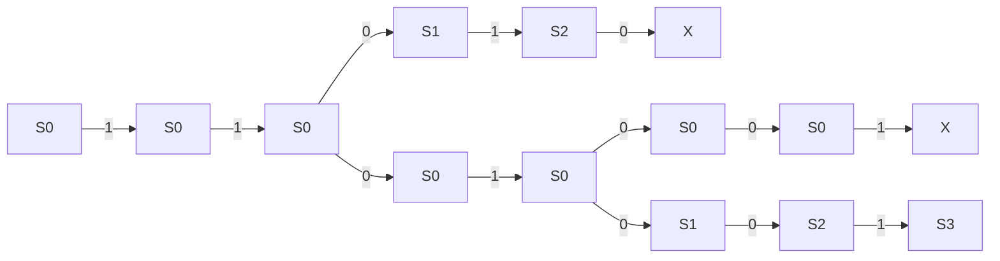

# AufS - 20.01.2025
- Potenzmengenautomat ist wichtig; den sollten wir können
- Ganze Beweise führen etwas zu weit; Es könnte sein, dass wir kleine Dinge beweisen müssen ("Zeigen Sie, dass XY eine reguläre Sprache ist"), aber große Beweise wie auf [[AuFS - 04 - Nichtdeterministische Endliche Automaten.pdf#page=18|dieser]] Folie werden für die Klausur nicht insofern relevant sein, dass wir diesen selbst führen werden müssen.

Es kann ein NEA in einen DEA verwandelt werden. Dabei wird quasi *"das Kreuzprodukt gebildet"*. 

Um Automaten zu transformieren, kann dafür gern eine Tabelle verwendet werden.

Wenn man einen NEA hat, dann kann daraus ein Potenzautomat gebaut werden, der wiederum *ein äquivalenter DEA* ist. 
In der Tabelle können für alle Zustandsmengen eine Zeile und für jede mögliche Eingabe eine Spalte hinzugefügt werden.

|               | $0$           | $1$   |
| ------------- | ------------- | ----- |
| $S_0$         | $S_0,S_1$     | $S_0$ |
| $S_0,S_1$     | $S_0,S_1,S_2$ | $S_0$ |
| $S_0,S_1,S_2$ | $S_0,S_1,S_2$ | $S_0$ |
Es kann auch sein, dass mit einer Eingabe keine Zustandsmenge erreicht werden kann. In diesem Fall wird die *leere Menge* $\emptyset$ eingetragen. Für diese wird eine eigene Spalte angelegt, allerdings wird diese nur mit der leeren Menge selbst gefüllt.

![[WhatsApp Bild 2025-01-20 um 10.44.27_6ce360de.jpg|500]]

Ein NEA darf zwei Startzustände besitzen.

Wir haben die Aufgaben in [[AuFS - 04 - Übung Nichtdeterministische Endliche Automaten.pdf]] bearbeitet. Zu 1) und 2) hier unsere Lösung:
![[EA Aufg1.png]]

| **$\huge\delta$** | **$\huge\varepsilon$** | **$0$**     | **$1$**     |
| ----------------- | ---------------------- | ----------- | ----------- |
| **$Q_0$**         | {$Q_0$}                | {$Q_0,Q_1$} | {$Q_0$}     |
| **$Q_1$**         | $\emptyset$            | {$Q_2$}     | {$Q_2$}     |
| **$Q_2$**         | $\emptyset$            | {$Q_3$}     | {$Q_3$}     |
| **$Q_3$**         | $\emptyset$            | $\emptyset$ | $\emptyset$ |

Trellis-Schema für $1101001$:

