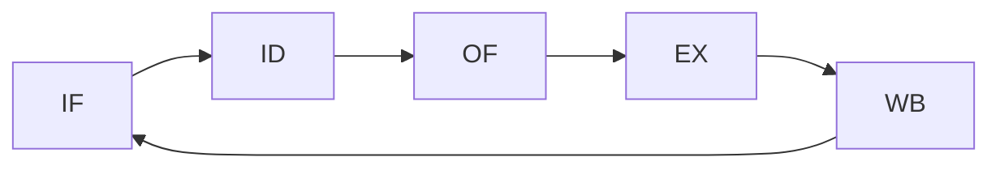

# Rechnersystem
>[!INFO] Definition
>Ein Rechensystem ist eine Informationsverarbeitende Einheit, das aus drei wesentlichen Komponenten besteht:
>- CPU
>- Ein- & Ausgabeeinheit
>- Speichereinheit

Der Datenaustausch unter den Komponenten läuft über sogenannte Busse.
>[!INFO] BUS
>Ein Bus ist eine Art Kabel, das eine Direktverbindung zwischen zwei Teilnehmern herstellt. Es gibt folgende Busse:
>- Datenbus
>- Steuerbus
>- Adressbus
## Ablauf einer Befehlsausführung
>[!INFO] 1. IF - **Instruction Fetch**
>Adressierung des Arbeitsspeichers durch den Befehlzähler (*Instruction Pointer*) und Ablage im Instruktionsregister (*Instruction Register*)

>[!INFO] 2. ID - **Instruction Decode**
>Anspringen der richtigen Mikrobefehlssequenz

>[!INFO] 3. OF - **Operand Fetch**
>Operanden aus den Registern holen

>[!INFO] 4. EX - **Execute**
>Durchführung der Operation im Rechenwerk

>[!INFO] 5. WB - **Writeback**
>Ergebnis in Registern oder Speicher abspeichern

