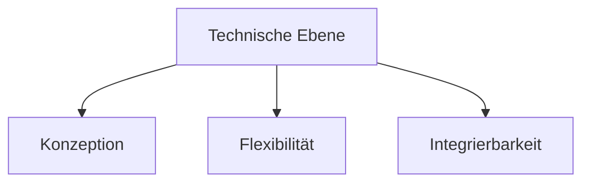
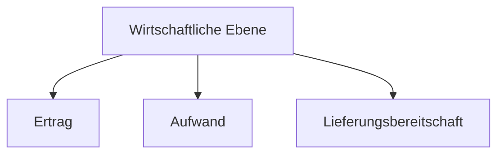
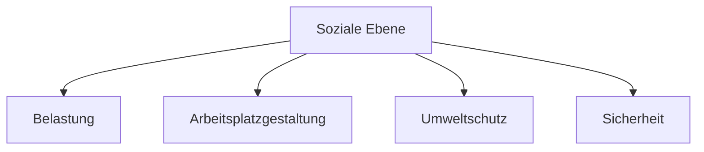

# Investition
>[!INFO] Definition
>Eine **Investition** ist die **Umwandlung liquider Mittel** eines Unternehmens **in Sachgüter, Dienstleistungen oder Forderungen**, also eine ***Umwandlung von KAPITAL in VERMÖGEN***.

## Aufteilung nach Kategorien
Dabei werden Investitionen in unterschiedliche Kategorien aufgeteilt:
- Güterart
- Zeitlicher Anfall
- Investitionszweck
Diese werden jeweils unterteilt in weitere Unterkategorien.

## Hauptprobleme bei Investitionen
Bei Investitionen können Probleme der folgenden Arten auftreten:
- Investitionen sind normalerweise langfristig geplant und haben daher ein hohes Risiko
- Begrenzte Finanzielle Mittel zwingen dazu, eine Auswahl von Investitionsalternativen zu treffen
- Aufgrund dynamischer Veränderungen und Abhängigkeiten kann schwer eine Voraussage getroffen werden
- Um eine verlässliche Beurteilung treffen zu können, müssen große Mengen an Daten verarbeitet werden.
- Investitionen können den Unternehmenserfolg stark beeinflussen

## Bewertung von Investitionen
Wie eben bereits gesagt, müssen Investitionen bewertet werden. Dies geschieht in drei Ebenen:
- Technische Ebene
- Wirtschaftliche Ebene
- Soziale Ebene
Jede dieser Ebenen wird weiter aufgeteilt in Unterebenen, wie folgt:
### Technische Kriterien

### Wirtschaftliche Kriterien

### Soziale Kriterien

## Methoden der Investitionsrechnung
Um bestimmen zu können, ob eine Investition sich rentieren wird, gibt es verschiedene Verfahren der [[Investitionsrechnung]].
Es gibt:
### Statische Verfahren
- [[Kostenvergleichsrechnung]]
- [[Gewinnvergleichsrechnung]]
- [[Rentabilitätsrechnung]]
- [[Amortisationsrechnung]]
### Dynamische Verfahren
- [[Kapitalwertmethode]]
- [[Interne Zinsfußmethode]]
- [[Annuitätenmethode]]

