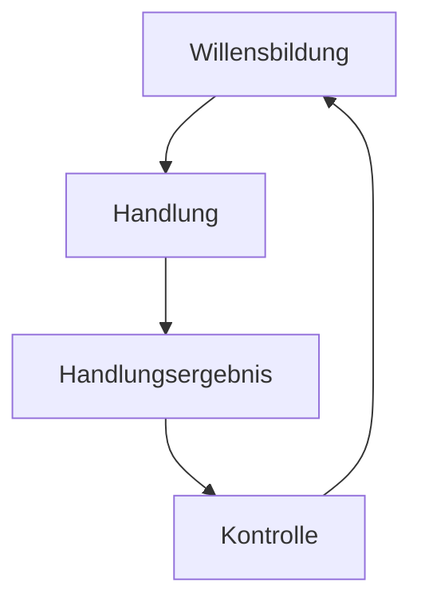

# Steuerungsprozess

>[!INFO] **Definition**
>Die Güter- und Finanzwirtschaftlichen Prozesse werden durch den Management-Prozess geordnet. 

>[!HINT] **Der Steuerungsprozess**
>Der Steuerungsprozess beginnt immer mit einer **Willensbildung**. Es wird also das Ziel erfasst. 
>Aus dieser Willensbildung leitet sich eine **Handlung** ab, die zur Zielerreichung führen soll. 
>Nach dieser Handlung wird **kontrolliert**, ob das Ziel erreicht wurde. Wenn nicht, wieso nicht?

