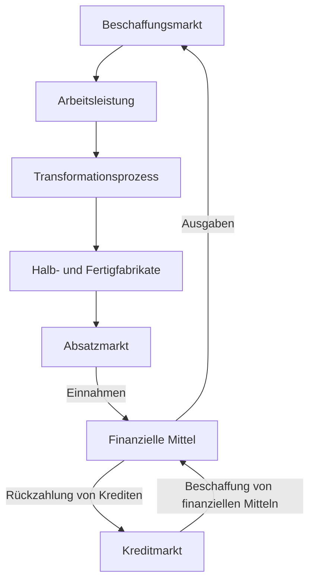

# Umsatzprozess

Zunächst werden die für die Produktion benötigten Mittel auf dem [[Beschaffunsmarkt]] beschafft. Anschließend werden, wenn nötig, finanzielle Mittel vom [[Kreditmarkt]] gezogen, um diese für die Transformation zu nutzen.
Nach der Transformation kann schließlich das fertige Erzeugnis am [[Absatzmarkt]] verkauft werden. Die daraus entstandenen [[Einnahme|Einnahmen]] werden verwendet, um 

