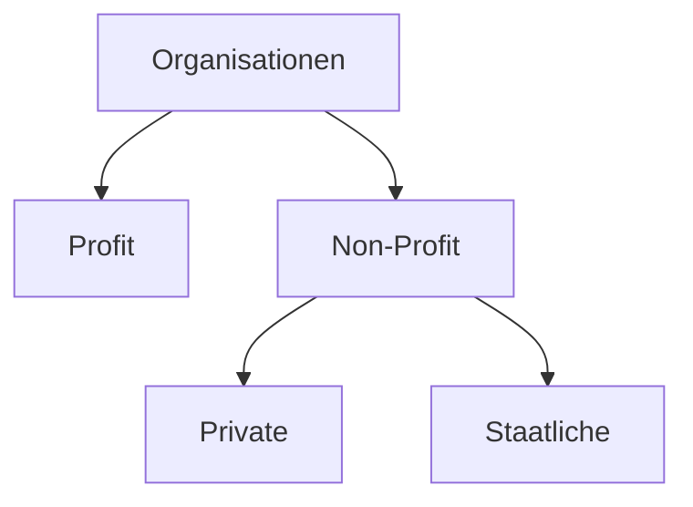
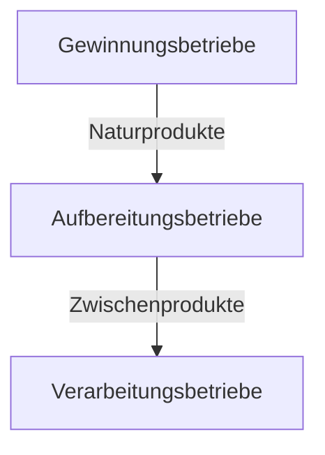

---
aliases:
  - Unternehmens
---
# Unternehmen

>[!INFO] **Definition**
>Ein Unternehmen ist eine [[Technische Einheit|technische]], soziale und wirtschaftliche Einheit mit dem Ziel der **[[Fremdbedarfsdeckung]]**, mit selbstständigen Entscheidungen und eigenen Risiken.
>
>Unternehmen sind auch **Produktionswirtschaften**. Das ist einfach zu merken, da sie Dinge Produzieren, um den [[Bedarf]] von anderen zu decken.

>[!Warning] **Unternehmen sind eine Unterart von [[Betrieb|Betrieben]].**

>[!DANGER] **Mitarbeiter von Unternehmen verfolgen privat soziale Ziele**
>Aus Management-Perspektive ist es das Ziel, wirtschaftliche und soziale Ziele zu erfüllen. **Glückliche Mitarbeiter arbeiten besser.**

>[!DEFINITION] **Merkmale eines Unternehmens**
>Ein Unternehmen ist ein offenes System, es hat also vielfältige Beziehungen mit der Umwelt, wie beispielsweise Beziehungen zu Geschäftspartnern und Stakeholdern. 
>
>Es ist auch ein dynamisches System, das sich im Laufe der Zeit anpassen muss, um trotz geänderten Umweltbedingungen zu überleben.
>
>Unternehmen sind außerdem ein komplexes System. Das heißt, dass sie kompliziert sind und die Ursache-Wirkungs-Beziehungen innerhalb des Systems nicht stabil, sondern wechselnd sind.
>- Eine Taschenuhr ist ein kompliziertes System, aber es ist nicht komplex, weil klar ist, dass sich die Zeiger bewegen, wenn ein Zahnrad sich um eine bestimmte Gradzahl dreht.
>  
>  Zusätzlich sind Unternehmen ein **marktgerichtetes System**; sie sind ausgerichtet auf Bedarfsdeckung von [[Markt|Märkten]].

### Umwelt eines Unternehmens:
Die Umwelt eines Unternehmens besteht aus 6 größeren Gruppen:
- [[Arbeitnehmer]]
- Staat
- [[Kunden]]
- [[Lieferanten]]
- [[Konkurrenten]]
- [[Kapitalgeber]]

Gleichzeitig beeinflussen die Natur, die Gesellschaft, der [[Wirtschaftsraum]] und die technologischen Gegebenheiten und Fortschritte ebenfalls Unternehmen.

### Systematisierung von Unternehmen
##### Systematisierung nach Profit & Non-Profit:

###### Non-Profit
>[!INFO] **Private Non-Profits**
>Zu privaten Non-Profit-Organisationen gehören beispielsweise
>- Wirtschaftliche
>- Soziokulturelle
>- Politische
>- Karikative (Charity, also gemeinnützige)

>[!INFO] **Staatliche Non-Profits**
>Zu staatlichen Non-Profit-Organisationen gehört beispielsweise
>- Öffentliche Gesundheitsversorgung
>- Öffentlich-Rechtliche Nachrichtensender

###### Profit
>[!INFO] **Profits**
>Profitorientiere Organisationen betreiben ihr Geschäft explizit mit dem [[Formalziel]], [[Gewinn]] zu erwirtschaften.

##### Systematisierung von Unternehmen nach Branche

##### Systematisierung von Unternehmen nach Größe
Unternehmen werden häufig anhand ihrer Beschäftigtengrößenklasse oder auch nach Umsatzgrößenklasse geordnet.
### Das Umfeld eines Unternehmens
>[!INFO] **Dimensionen des Umfeldes**
>- [[Markt|Märkte]], wo [[Angebot]] und [[Nachfrage]] aufeinander treffen
>- [[Unternehmen#Umwelt eines Unternehmens|Umweltbereiche]]
>- [[Anspruchsgruppen]], wie [[Arbeitnehmer]], [[Lieferanten]], [[Kunden]], [[Konkurrenten]] und Behörden

