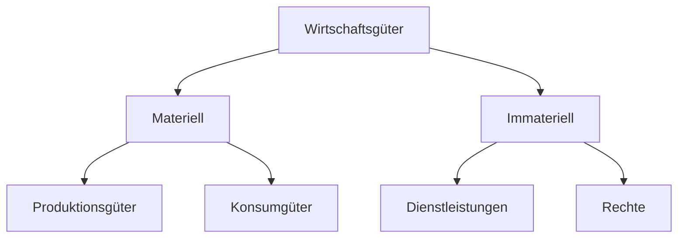

---
aliases:
  - Wirtschaftsgüter
  - Güter
---
# Wirtschaftsgut

>[!SUMMARY] **Beschreibung**
>SomeText

>[!WARNING] **Varianten**
>Wirtschaftsgüter lassen sich in mehrere Varianten untergliedern:
>**Materiell:**
>- [[Produktionsgut|Produktionsgüter]]
>- [[Konsumgut|Konsumgüter]]
>  
>  **Immateriell:**
>- [[Dienstleistung|Dienstleistungen]]
>- [[Recht|Rechte]]

>[!EXAMPLE]
>aSimpleExample

#tbcompleted