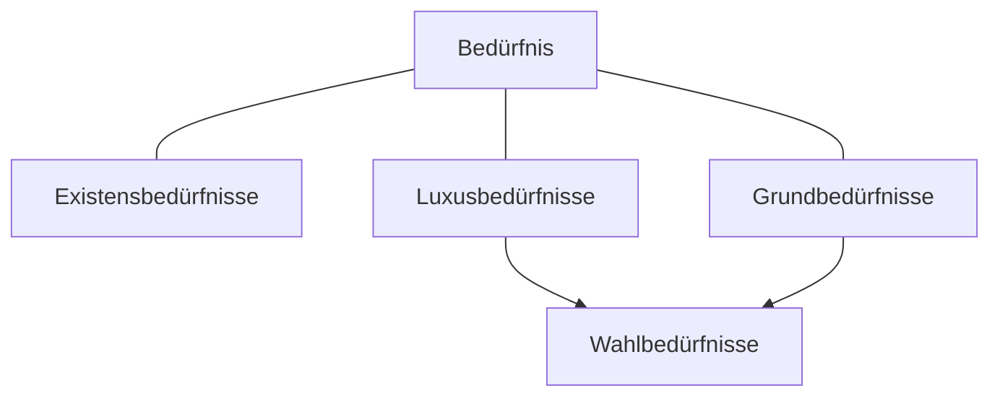

>[!Summary]
>Ein Bedürfnis wird als das empfinden eines Mangels bezeichnet.
>Werden erfüllt durch [[Güter]]

## Existenzbedürfnisse

> [!info]
> Existenzbedürfnisse Dienen der Selbsterhaltung und ist Überlebens wichtig

>[!example] 
>Nahrung, Kleidung, Wohnung

## Grundbedürfnisse

>[!info]
>Grundbedürfnisse sind Kulturell oder Sozial bedingt.

>[!Example]
>Bildung, Möbel, Smartphone, 

## Luxusbedürfnisse

>[!Info]
>Luxusbedürfnisse erfüllen einen Wunsch nach Auszeichnung oder Anerkennung.

>[!Example]
>Schmuck, Porsche, Rolex

## Fremdbedarfsdeckung

>[!summary]
>Ist die Erfüllung/ Deckung eines bedarfs außerhalb des eigenen. 

## Eigenbedarfsdeckung

>[!summary]
>Ist die Erfüllung/ Deckung des eigenen Bedarfs. 

