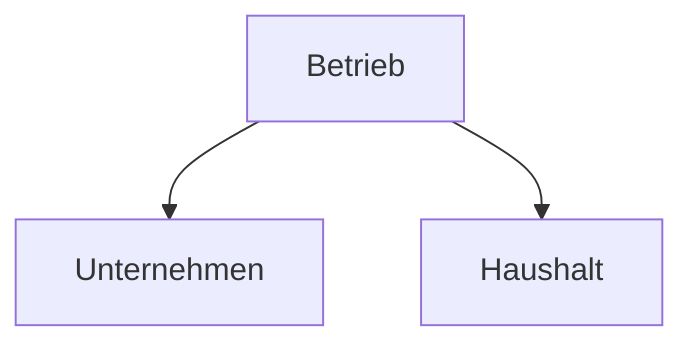

>[!info]
>Ein Betrieb ist eine technische, soziale und wirtschaftliche Einheit mit der Aufgabe der Bedarfsdeckung, mit selbständigen Entscheidungen und eigenen Risiken.
>

>[!Merkmale]
>- Lässt sich real beobachten.
>- Bedarfsdeckung ist ihr materiales Ziel ([[Ziele#Sachziele|Sachziele]]).
>- Sie verfolgen wirtschaftliche Ziele ([[Ziele#Formalziele|Formalziele]]).
>- Sie beschäftigen Mitarbeiter die ([[Ziele#Soziale Ziele|Soziale Ziele]]) verfolgen.

## Betriebe einteilen/ systematisieren 
![[Screenshot 2024-11-07 173028.png]]

## Haushalt

>[!summary]
>Hauptaufgabe ist [[Bedürfnisse#Eigenbedarfsdeckung|Eigenbedarfsdeckung]]

>[!Merkmale]
>- Ist technische Einheit 
>-  ist soziale Einheit
>- ist wirtschaftliche Einheit
>- Eigenständige Entscheidungen
>- Eigenständige Risiken

## Unternehmen

>[!summary]
>Hauptaufgabe ist [[Bedürfnisse#Fremdbedarfsdeckung|Fremdbedarfsdeckung]]

>[!Merkmale]
>-  Ist technische Einheit 
>-  ist soziale Einheit
>-  ist wirtschaftliche Einheit
>- Eigenständige Entscheidungen
>- Eigenständige Risiken 
>- Offenes System (vielfältige Beziehungen mit der Umwelt)
>- Dynamisches System (Anpassungsnotwendigkeit im Zeitablauf)
>- Komplexes System (Sich ändernde Strukturen und Abläufe)
>- Marktgerichtetes System (ausgerichtet auf Bedarfsdeckung von Märkten)

