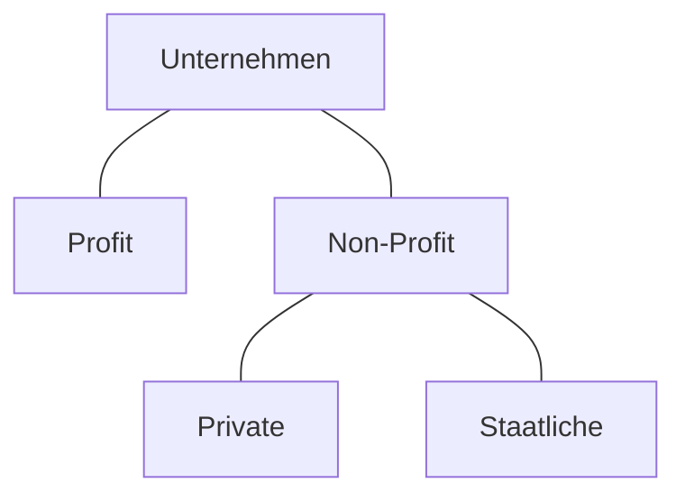

>[!summary]
>- Gewinn: Unternehmen lassen sich, in die die Gewinn machen und die die das nicht tun, einteilen.
>- Branche: Unternehmen lassen sie sich in Branchen sowie Wertschöpfungsstufen einteilen.
>- Größe: Verwendung verschiedener Kennzahlen um Unternehmen nach Größe zu Gruppieren
>- Produktionsstruktur: Was für die Produktion am wichtigsten ist, wie viel produziert wird und wie.
## Gewinnorientierung

>[!info]
>Unternehmen lassen sich einteilen in Unternehmen die Gewinne erwirtschaften (**Profit**) und diese die Keinen Profit erwirtschaften(**Non-Profit**).
>Non-Profit unternehmen lassen sich darüber hinaus weiter in Private und Staatliche Unternehmen aufteilen, je nachdem wer sie besitzt.

>[!Example]
>### Profit
>Nvidia, Amazon, Kion, Autoflug, Airbus
>### Private Non-Profit
>SOS-Kinderdorf, World Vision Deutschland e. V. (**WVD**), Deutsches Kinderhilfswerk, die meisten Nicht staatlichen Hilfsorganisationen
>### Staatliche Non-Profit
>Unicef, das Rote Kreuz, DLRG

## Branche

>[!note]
>- Ob sie ein Gewinnungsbetrieb sind der Naturstoffe abbaut.
>- Ob sie ein Aufbereitungsbetrieb sind der Naturstoffe zu Zwischenprodukten verarbeitet
>- Ob sie ein Verarbeitungsbetrieb sind der das Endprodukt Herstellt.
>- Ob sie ein Dienstleistungsbetrieb sind.
>- Sowie den Marktzweig in dem sie tätig sind.

>[!warning]
>Ein Unternehmen kann auch mehrere Plätze in der Kette haben.

![[Screenshot 2024-11-22 174050.png]]

>[!example]
>### Sachleistungsbetriebe
>- #### Gewinnungsbetrieb/Branche
>- Land- und Forstwirtschaft
>- Bergbau
>- #### Aufbereitungsbetrieb/Branche
>- Sägewerk
>- Schmelzanlagen
>- #### Verarbeitungsbetrieb/Branche
>- Möbelhersteller
>- Autobauer
>### Dienstleitungsbetriebe
>- Krankenkassen
>- Grundstücks- und Wohnungswesen

## Größe

>[!info]
>Hier lassen sich verschiedene Kennzahlen verwenden wie Umsatz oder Beschäftigungsgröße.

![[Screenshot 2024-11-22 175556.png]]
![[Screenshot 2024-11-22 175607.png]]

## Produktionsstruktur
>[!summary]
>- Was für die Produktion am wichtigsten ist.
>- Wie viel gefertigt wird.
>- Wie gefertigt wird.
### Hauptproduktionsfaktor

>[!info]
>Welcher [[Begriffe#Produktionsfaktoren]] am wichtigsten ist.

![[Screenshot 2024-11-22 180416.png]]

>[!example]
>- ### Personalintensiv
>- Krankenkassen
>- ### Anlagenintensiv
>- Lebensmittelhersteller
>- ### Materialintensiv
>- Fahrzeughersteller
>- ### Energieintensiv
>- Bitcoin farm
>- ### Informationsintensiv
>- Ai unternehmen
### Fertigungstypen

>[!info]
>Wie viele gefertigt werden Einzel- oder Mehrfach Fertigung. 

![[Screenshot 2024-11-22 180633.png]]
### Fertigungsverfahren

>[!info]
>Wie gefertigt wird.
>- Werkstattprinzip das alles an einem Ort zusammengebaut wird.
>- Fließbandprinzip das an vielen Orten ein teil zum Produkt hinzugefügt wird.

![[Screenshot 2024-11-22 181343.png]]