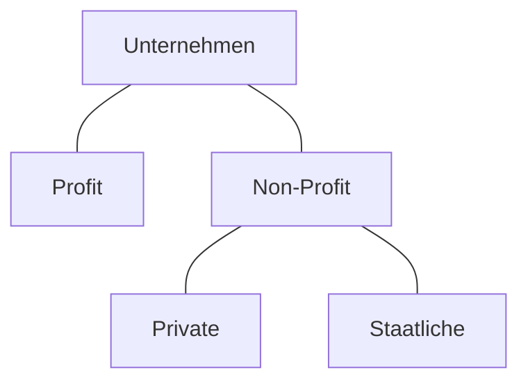

## Gewinnorientierung

>[!summary]
>Unternehmen lassen sich einteilen in Unternehmen die Gewinne erwirtschaften (**Profit**) und diese die Keinen Profit erwirtschaften(**Non-Profit**).
>Non-Profit unternehmen lassen sich darüber hinaus weiter in Private und Staatliche Unternehmen aufteilen, je nachdem wer sie besitzt.

>[!Example]
>### Profit
>Nvidia, Amazon, Kion, Autoflug, Airbus
>### Private Non-Profit
>SOS-Kinderdorf, World Vision Deutschland e. V. (**WVD**), Deutsches Kinderhilfswerk, die meisten Nicht staatlichen Hilfsorganisationen
>### Staatliche Non-Profit
>Unicef, das Rote Kreuz, DLRG

## Branche
