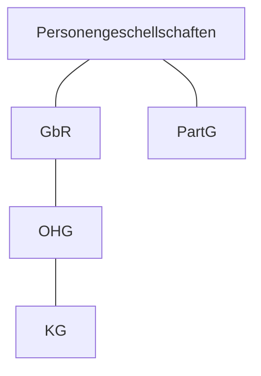

## Einzelunternehmen

>[!Gesselschafter]
>Einzelne [[Begriffe#Natürliche Person|Natürliche Person]]
>Wird Kaufmann/frau

>[!Haftung]
>Unbeschränkt auch mit Privat vermögen

>[!note]
>- Gesselschafter muss sich im Handelsregister eintragen und ist Kaufmann, es sei den sein Unternehmen ist so klein das es nicht nach kaufmännischer Art und umfang bedarf ( Kleingewerbe). Wenn er z.B. wenig gewinn macht.

>[!example]
>[[Begriffe#Firma|Firma]]: Tischlerei Max Hennings

# Personengeschellschaften

>[!note]
>Sind Keine Juristischen Personen oder Kaufleute
## Gesellschaft des bürgerlichen Rechts *(GbR)*

>[!note]
>Grundform aller Personengesellschaften

>[!Gesselschafter]
>mindestens 2x Gesselschafter. 
>[[Begriffe#Natürliche Person|Natürliche Person]] und [[Begriffe#juristische Person|juristische Person]]

>[!Haftung]
>Unbeschränkt und Persönlich

>[!Note]
>- Vereinbarung eines Zwecks (Zweck gebunden)
>- Alle Gesellschafter Verpflichten sich diesen Zweck zu Fördern

>[!example]
> ARGES (Arbeitsgemeinschaften bei großen Bauprojekten)

## Patnergesellschaft *(PartG)*

>[!Note]
>- Rechtsform für Angehörige freier Berufe (Anwälte, Ärzte)
>- Gesellschaft übt kein Handelsgewerbe aus, da sie keine kaufmännischer Art und umfang bedarf.
>- Keine Eintragung im Handelsregister sowie kein Kaufmann.

>[!Gesselschafter]
>[[Begriffe#Natürliche Person|Natürliche Person]]

>[!Haftung]
>Unbeschränkt und Persönlich
>>[!Ausnahme]
>>Bei fehlerhafter Berufs Ausübung können die Gesellschafter den ausübenden alleine Haften lassen.

>[!example]
>Werner & ten Brink - Patentanwälte Partnerschaftsgesellschaft

## Offene Handelsgesellschaft *(OHG)*

>[!note]
>sonderform der GbR

>[!Gesselschafter]
>mindestens 2x Gesselschafter. 
>[[Begriffe#Natürliche Person|Natürliche Person]] und [[Begriffe#juristische Person|juristische Person]]
>Werden Kauleute

>[!note]
>- Gerichtet auf den Betrieb eines vollkaufmännischen Handelsgewerbes unter gemeinsamer [[Begriffe#Firma|Firma]]
>- Verpflichtung aller Vertragspartner zur Förderung des Betriebs
>- Handelsregister Eintragung. 

>[!Haftung]
>Unbeschränkt und Persönlich

>[!example]
>Beispiel: ALDI Einkauf SE & Co. oHG

## Komanditgesellschaft *(KG)*

>[!note]
>sonderform der OHG

>[!Gesselschafter]
>mindestens 2x Gesselschafter. 
>[[Begriffe#Natürliche Person|Natürliche Person]] und [[Begriffe#juristische Person|juristische Person]]
>Werden Kauleute

>[!note]
>- Gerichtet auf den Betrieb eines vollkaufmännischen Handelsgewerbes unter gemeinsamer [[Begriffe#Firma|Firma]]
>- Verpflichtung aller Vertragspartner zur Förderung des Betriebs
>- Handelsregister Eintragung. 

>[!Haftung]
>>#### Arten von Gesellschaftern
>>- ###### Komplementär
>> Haftet unbeschränkt und Persönlich
>>- ###### Kommanditisten
>>Haftet nur mit seiner Vermögenseinlage

>[!example]
>Beispiel: Adolf Würth GmbH & Co. KG

# Kapitalgesellschaften

## Gesellschaft mit beschränkter Haftung (GmbH)

>[!Für]
>Unternehmen mit Kleinerem bis Mittlerem Kapitalbedarf

>[!ist]
>- Eine Juristische Person
>- Eine Handelsgesellschaft
>- Ein Kaufmann

>[!Gesselschafter]
>[[Begriffe#Natürliche Person|Natürliche Person]] und [[Begriffe#juristische Person|juristische Person]]

>[!Haftung]
>Nur mit Gesellschaftsvermögen, also Gesellschaftereinlagen.

>[!example]
>Beispiel: Robert Bosch GmbH

## Aktiengesellschaft (AG)

>[!Für]
>Unternehmen mit Großem Kapitalbedarf

>[!ist]
>- Eine Juristische Person
>- Eine Handelsgesellschaft
>- Ein Kaufmann

>[!Gesselschafter]
>Eine große Zahl (anonymer) Gesellschafter.
>[[Begriffe#Natürliche Person|Natürliche Person]] und [[Begriffe#juristische Person|juristische Person]]

>[!Haftung]
>Nur mit Gesellschaftsvermögen, also Gesellschaftereinlagen.