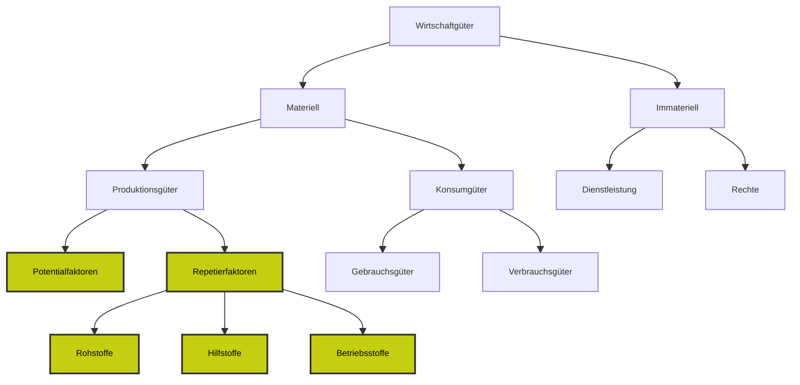

>[!Info]
 Siehe [[Güter#Knappe Güter|Knappe Güter]]
## Einteilung

## Repetierfaktoren

>[!summary]
>Auch Werkstoffe genannt. 
>Sind die Stoffe oder Ressourcen die zur Herstellung auf einen ***Kurzen*** Zeitraum benötigt werden.

>[!Tip]
>Die Stoffe die zur in Repeat Funktion des Unternehmens gepackt werden um Produkte zu bekommen. 

>[!Example]
> - Holz beim Möbelhersteller
> - Stahlrahmen bei Still 

## Potenzialfaktoren

>[!summary]
>Auch Investitionsgüter genannt.
>Sind die Stoffe oder Ressourcen die zur Herstellung auf einen ***Langen*** Zeitraum benötigt werden.
>

>[!Example]
> - Elektrische Säge im Sägewerk
