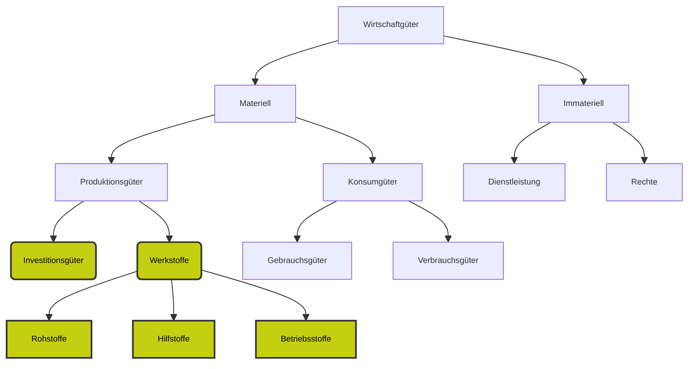

>[!Info]
 Siehe [[Güter#Knappe Güter|Knappe Güter]]
## Einteilung

```mermaid
%%{init: {'themeVariables': {'fontSize': '10px'}}}%%
graph TD
    Wirtschaftgüter-->Immateriell
    Wirtschaftgüter-->Materiell
    Materiell-->Konsumgüter
    Materiell-->Produktionsgüter
    Immateriell-->Dienstleistung
    Immateriell-->Rechte
    Produktionsgüter-->Potentialfaktoren(Investitionsgüter)
    Produktionsgüter-->Repetierfaktoren(Werkstoffe)
    Repetierfaktoren(Werkstoffe)-->Rohstoffe
    Repetierfaktoren(Werkstoffe)-->Hilfstoffe
    Repetierfaktoren(Werkstoffe)-->Betriebsstoffe
    Konsumgüter-->Gebrauchsgüter
    Konsumgüter-->Verbrauchsgüter
    


    %% Markiere die gewünschten Felder
    class Potentialfaktoren,Repetierfaktoren,Rohstoffe,Hilfstoffe,Betriebsstoffe highlighted;

    %% Definiere die Klasse "highlighted"
    classDef highlighted fill:#c5cf11,stroke:#333,stroke-width:2px,color:#000;
```
